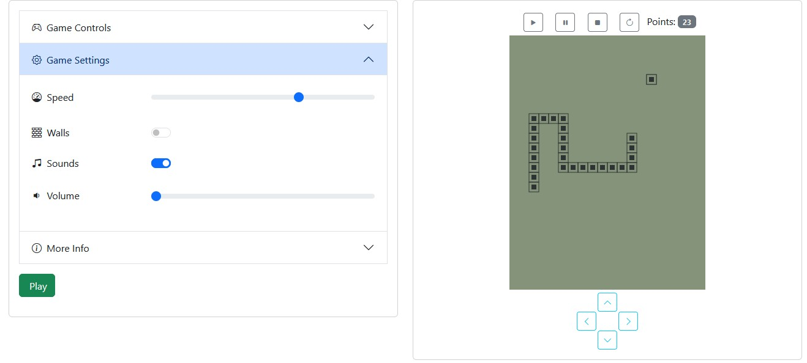

# IPA Snake Game
My adaptation of tetris game on javascript.



## Table of content
- [Install](#install)
- [Samples](#samples)
- [Usage](#usage)
- [Configuration](#configuration)
- [License](#license)

## Install
Download or install this repository to your project.

Install packages
```bash
npm install
```

## Samples
Samples for this game takes from site [rekkerd.org](https://rekkerd.org/mr-9999-brick-game-9999-in-1-samples/)

## Usage
Check **examples** folder with examples how to run a tetris. Actions, settings, controls are optional. All what you need it's just add css and js to your page, and past code:

```html
<div data-ipa-tetris-game="init"></div>
```

## Configuration
Check **examples** folder.

_**Will be added!**_

## License

The IPA tetris game is licensed under the [GPL-3.0](/LICENSE).